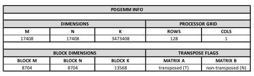
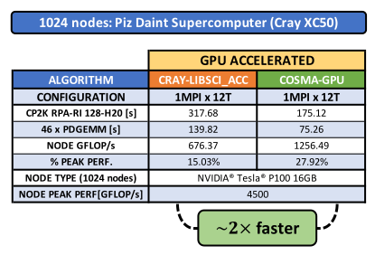
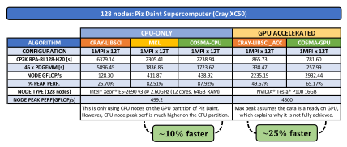
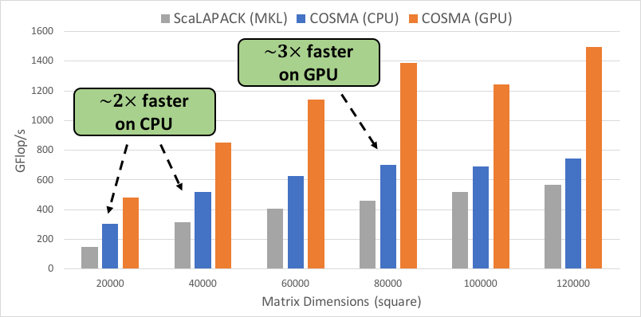

[](https://gitlab.com/cscs-ci/eth-cscs/COSMA/-/commits/master)

<p align="center"></p>

## Table of Contents
- [Overview](#overview)
- [COSMA Literature](#cosma-literature)
- [Features](#features)
- [Building COSMA](#building-cosma)
- [COSMA Dependencies](#cosma-dependencies)
- [Using COSMA](#using-cosma)
    - [30 seconds Tutorial](#using-cosma-in-30-seconds)
- [COSMA in production](#cosma-in-production)
    - [CP2K](#cp2k)
    - [Julia language](#julia-language)
- [Examples - Miniapps](#miniapps)
    - [Matrix Multiplication with COSMA](#matrix-multiplication)
    - [COSMA pxgemm wrapper](#cosma-pxgemm-wrapper)
- [Tunable Parameters](#tunable-parameters)
    - [Parameters Overview](#parameters-overview)
    - [Controlling GPU memory](#controlling-gpu-memory)
    - [Controlling CPU memory](#controlling-cpu-memory)
- [Performance Profiling](#profiling)
- [Authors](#authors)
- [Questions?](#questions)
- [Acknowledgements](#acknowledgements)

## Overview

COSMA is a parallel, high-performance, GPU-accelerated, matrix-matrix multiplication algorithm that is communication-optimal for all combinations of matrix dimensions, number of processors and memory sizes, without the need for any parameter tuning. The key idea behind COSMA is to first derive a tight optimal sequential schedule and only then parallelize it, preserving I/O optimality between processes. This stands in contrast with the 2D and 3D algorithms, which fix process domain decomposition upfront and then map it to the matrix dimensions, which may result in asymptotically more communication. The final design of COSMA facilitates the overlap of computation and communication, ensuring speedups and applicability of modern mechanisms such as RDMA. COSMA allows to not utilize some processors in order to optimize the processor grid, which reduces the communication volume even further and increases the computation volume per processor.

COSMA got the **Best Student Paper Award** at the prestigious **Supercomputing 2019** conference in Denver, US.

COSMA alleviates the issues of current state-of-the-art algorithms, which can be summarized as follows:

- `2D (SUMMA)`: Requires manual tuning and not communication-optimal in the presence of extra memory.
- `2.5D`: Optimal for `m=n`, but inefficient for `m << n` or `n << m` and for some numbers of processes `p`.
- `Recursive (CARMA)`: Asymptotically communication-optimal for all `m, n, k, p`, but splitting always the largest dimension might lead up to `√3` increase in communication volume. 
- `COSMA (this work)`: Strictly communication-optimal (not just asymptotically) for all `m, n, k, p` and memory sizes that yields the speedups by factor of up to 8.3x over the second-fastest algorithm.

In addition to being communication-optimal, this implementation is higly-optimized to reduce the memory footprint in the following sense:
- `Buffer Reuse`: all the buffers are pre-allocated and carefully reused during execution, including the buffers necessary for the communication, which reduces the total memory usage.
- `Reduced Local Data Movement`: the assignment of data blocks to processes is fully adapted to communication pattern, which minimizes the need of local data reshuffling that arise after each communication step.

The library supports both one-sided and two-sided MPI communication backends. It uses `dgemm` for the local computations, but also has a support for the `GPU` acceleration through our `Tiled-MM` library using `cublas` or `rocBLAS`.

## COSMA Literature
 
The paper and other materials on COSMA are available under the following link:
- **ACM Digital Library (Best Student Paper Award at SC19):** https://dl.acm.org/doi/10.1145/3295500.3356181 
- **Arxiv:** https://arxiv.org/abs/1908.09606
- **YouTube Presentation:** https://www.youtube.com/watch?v=5wiZWw5ltR0
- **Press Release:** https://www.cscs.ch/science/computer-science-hpc/2019/new-matrix-multiplication-algorithm-pushes-the-performance-to-the-limits/

## Features

- **ScaLAPACK API Support:** it is enough to link to COSMA, without changing the code and all `p?gemm` calls will use ScaLAPACK wrappers provided by COSMA.
- **C/Fortran Interface:** written in `C++`, but provides `C` and `Fortran` interfaces.
- **Custom Types:** fully templatized types.
- **GPU acceleration:** supports both **NVIDIA** and **AMD** GPUs.
- **Supported BLAS (CPU) backends:** MKL, LibSci, NETLIB, BLIS, ATLAS. 
- **Custom Data Layout Support:** natively uses its own blocked data layout of matrices, but supports arbitrary grid-like data layout of matrices.
- **Tranposition/Conjugation Support:** matrices `A` and `B` can be transposed and/or conjugated.
- **Communication and Computation Overlap:** supports overlapping of communication and computation.
- **Spack Installation:** can be built and installed with `Spack` since v14.1
- **Julia Package:** see https://github.com/haampie/COSMA.jl/ on how to use COSMA in the Julia language.

## Building COSMA

See [Installation Instructions](INSTALL.md).

## COSMA Dependencies

COSMA is a CMake project and requires a recent CMake(>=3.12).

External dependencies: 

- `MPI 3`: (required)
- `BLAS`: when the problem becomes local, COSMA uses provided `?gemm` backend, which can be one of the following:
     - `MKL` (default) 
     - `OPENBLAS`
     - `BLIS`
     - `ATLAS`
     - `CRAY_LIBSCI`: `Cray-libsci` or `Cray-libsci_acc` (GPU-accelerated)
     - `CUDA`: `cublas` is used for NVIDIA GPUs
     - `ROCM`: `rocBLAS` is used for AMD GPUs
     - `CUSTOM`: user-provided BLAS API

Some dependencies are bundled as submodules and need not be installed explicitly:

- `TiledMM` - cublasXt GEMM replacement, that is also ported to AMD GPUs.
- `COSTA` - distributed matrix reshuffle and transpose algorithm.
- `semiprof` - profiling utlility
- `gtest_mpi` - MPI utlility wrapper over GoogleTest (unit testing library)

## Using COSMA

To allow easy integration, COSMA can be used in the following ways:
- **without changing your code:** if your code already uses the `ScaLAPACK API`, then you can just link to COSMA, before linking to any other library providing `pxgemm` and all `pxgemm` calls will be using COSMA, without the need to change your code at all. To get a feeling of the performance you can expect to get, please have a look at the [pdgemm miniapp](#cosma-pdgemm-wrapper). To see how you can link your code to COSMA `pxgemm`, have a look at the [30 seconds tutorial](#using-cosma-in-30-seconds) on how to do this. In this way, we integrated COSMA into CP2K quantum chemistry simulator, which you can read more about in the [production example](#cosma-in-production).

- **adapting your code:** if your code is not using ScaLAPACK, then there are two interfaces that can be used:
    - **custom layout:** if you matrices are distributed in a custom way, then it is eanough to pass the descriptors of your data layout to `multiply_using_layout` function, which will then adapt COSMA to your own layout.
    - **native COSMA layout:** to get the maximum performance, the native COSMA matrix layout should be used. To get an idea of the performance you can expect to get, please have a look at the [matrix multiplication miniapp](#matrix-multiplication).
    
The documentation for the latter option will soon be published here.

## Using COSMA in 30 seconds

For easy integration, it is enough to build COSMA with ScaLAPACK API and then link your code to COSMA before linking to any other library providing ScaLAPACK `pxgemm`. This way, all `pxgemm` calls will be using COSMA `pxgemm` wrappers. To achieve this, please follow these steps:

1) Build COSMA with ScaLAPACK API:
```bash
###############
# get COSMA
###############
git clone --recursive https://github.com/eth-cscs/COSMA cosma && cd cosma

##############################
# build and install COSMA
##############################
mkdir build && cd build

# set up the compiler, e.g. with:
export CC=`which cc`
export CXX=`which CC`

# choose BLAS and SCALAPACK versions you want to use
# COSMA_BLAS can be: MKL, OpenBLAS, CRAY_LIBSCI, CUDA, ROCM, CUSTOM
# COSMA_SCALAPACK can be MKL, CRAY_LIBSCI, CUSTOM
cmake -DCOSMA_BLAS=CUDA -DCOSMA_SCALAPACK=MKL -DCMAKE_INSTALL_PREFIX=<installation dir>/cosma ..
make -j 8
make install
```
> !! Note the *--recursive* flag !!

2) Link your code to COSMA:
    - **CPU-only** version of COSMA:
       - link your code to:
       > -L<installation dir>/cosma/lib64 -lcosma_pxgemm -lcosma -lcosta_scalapack 
 
       - then link to the BLAS and ScaLAPACK you built COSMA with (see `COSMA_BLAS` and `COSMA_SCALAPACK` flags in cmake):
       > -L${MKLROOT}/lib/intel64 -Wl,--no-as-needed -lmkl_scalapack_lp64 -lmkl_intel_lp64 -lmkl_gnu_thread -lmkl_core -lmkl_blacs_intelmpi_lp64 -lgomp -lpthread -lm
 
    
   - using **GPU-accelerated** version of COSMA: 
       - link your code to:
       >-L<installation dir>/cosma/lib64 -lcosma_pxgemm -lcosma -lcosta_scalapack -lTiled-MM
       
       - link to the GPU backend you built COSMA with (see `COSMA_BLAS` flag in cmake):
       >-lcublas -lcudart -lrt
       
       - then link to the ScaLAPACK you built COSMA with (see `COSMA_SCALAPACK` flag in cmake):
       >-L${MKLROOT}/lib/intel64 -Wl,--no-as-needed -lmkl_scalapack_lp64 -lmkl_intel_lp64 -lmkl_gnu_thread -lmkl_core -lmkl_blacs_intelmpi_lp64 -lgomp -lpthread -lm
       
3) Include headers:
>-I<installation dir>/cosma/include

## COSMA in Production

### CP2K

COSMA is integrated into the [CP2K](https://www.cp2k.org) quantum chemistry simulator. Since COSMA provides ScaLAPACK API, it is enough to link CP2K to COSMA, without changing CP2K code at all, which makes the integration trivial even if (as in the case of CP2K) the simulation code is in written Fortran.

In the production run, we ran *Random-Phase Approximation (RPA)* benchmark of 128 water molecules, using the *Resolution of Identity (RI)*. The benchmark was run once on 1024 and once on 128 nodes of the GPU partition on [Piz Daint supercomputer](https://www.cscs.ch/computers/piz-daint/) (Cray XC50). Computationally, the most dominant part of this benchmark consists of 46 **tall-and-skinny** dense matrix multiplications, with the parameters shown in the table below:

<p align="center"></p>

On **1024 nodes**, we compared the performance of CP2K using `COSMA` and `Cray-libsci_acc` (version: 19.10.1), both being GPU accelerated, for all dense matrix-matrix multiplications (`pdgemm` routine). As can be seen in the following table, the version with COSMA was approximately **2x faster**.

<p align="center"></p>

On **128 nodes**, we compared the performance of CP2K using the following algorithms for multiplying matrices (`pdgemm` routine):  `MKL` (version: 19.0.1.144), `Cray-libsci` (version: 19.06.1), `Cray-libsci_acc` (version: 19.10.1, GPU accelerated) and `COSMA` (both CPU-only and GPU-accelerated versions) libraries. The version with COSMA was the fastest on both CPU and GPU. The CPU version of COSMA achieved the peak performance, whereas the GPU version achieved more than 65\% of the peak performance of GPUs. Keep in mind that the peak performance of GPUs assumes the data is already residing on GPUs which is not the case here, since matrices were initially residing on CPU. This is one of the reasons why the peak performance is not achieved with the GPU version. Still, the GPU version of COSMA was **25-27\%** faster than the second best in this case. The results are summarized in the following table:

<p align="center"></p>

With COSMA, even higher speedups are possible, depending on matrix shapes. To illustrate possible performance gains, we also ran different **square matrix** multiplications on the same number of nodes (**=128**) of [Piz Daint supercomputer](https://www.cscs.ch/computers/piz-daint/). The block size is `128x128` and the processor grid is also square: `16x16` (2 ranks per node). The performance of COSMA is compared against Intel MKL ScaLAPACK (version: 19.0.1.144). The results on Cray XC50 (GPU-accelerated) and Cray XC40 (CPU-only) are summarized in the following table: 

<p align="center"></p>

All the results from this section assumed matrices given in (block-cyclic) ScaLAPACK data layout. However, if the native COSMA layout is used, even higher throughput is possible. 

### Julia language

The [COSMA.jl](https://github.com/haampie/COSMA.jl/) Julia package uses COSMA's C-interface to provide COSMA-based matrix-matrix multiplication for the [DistributedArrays.jl](https://github.com/JuliaParallel/DistributedArrays.jl/) package. A minimal working example to multiply two random matrices looks as follows:

```julia
using MPIClusterManager, DistributedArrays, Distributed

manager = MPIManager(np = 6)
addprocs(manager)
COSMA.use_manager(manager)

@everywhere using COSMA

A = drand(8000, 8000) * drand(8000, 8000)
```

## Miniapps

```bash
# for CPU-only version
sbatch schedule_miniapp_on_daint_cpu.sh
# for Hybrid (CPU+GPU) version
sbatch schedule_miniapp_on_daint_gpu.sh
```
The script will use SLURM to submit a job on 10 nodes. The job will run 2 matrix
multiplications and output the time COSMA algorithm took.

### Matrix Multiplication

The project contains a miniapp that produces two random matrices `A` and `B`,
computes their product `C` with the COSMA algorithm and outputs the time of the
multiplication.

The miniapp consists of an executable `./build/miniapp/cosma_miniapp` which can
be run with the following command line (assuming we are in the root folder of
the project):

```bash
# set the number of threads to be used by each MPI rank
export OMP_NUM_THREADS=18
# if using CPU version with MKL backend, set MKL_NUM_THREADS as well
export MKL_NUM_THREADS=18 
# run the miniapp
mpirun -np 4 ./build/miniapp/cosma_miniapp -m 1000 -n 1000 -k 1000 -r 2
```

The overview of all supported options is given below:
- `-m (--m_dim)` (default: `1000`): number of rows of matrices `A` and `C`.
- `-n (--n_dim)` (default: `1000`): number of columns of matrices `B` and `C`.
- `-k (--k_dim)` (default: `1000`): number of columns of matrix `A` and rows of matrix `B`.
- `-s (--steps)` (optional): string of triplets divided by comma defining the
  splitting strategy. Each triplet defines one step of the algorithm. The first
  character in the triplet defines whether it is a parallel (p) or a sequential
  (s) step. The second character defines the dimension that is splitted in this
  step. The third parameter is an integer which defines the divisor. This
  parameter can be omitted. In that case the default strategy will be used. An example of a possible value for the upper example: `--steps=sm2,pn2,pk2`.
- `-r (--n_rep)` (optional, default: `2`): the number of repetitions.
- `-t (--type)` (optional, default: `double`): data type of matrix entries. Can be one of: `float`, `double`, `zfloat` and `zdouble`. The last two correspond to complex numbers.
- `--test` (optional): if present, the result of COSMA will be verified with the result of the available SCALAPACK.
- `-h (--help) (optional)`: print available options.

### COSMA pxgemm wrapper

COSMA also contains a wrapper for ScaLAPACK `pxgemm` calls which offers scalapack interface (pxgemm functions with exactly the same signatures as ScaLAPACK). Running these functions will take care of transforming the matrices between ScaLAPACK and COSMA data layout, perform the multiplication using COSMA algorithm and transform the result back to the specified ScaLAPACK data layout.

The miniapp consists of an executable `./build/miniapp/pxgemm_miniapp` which can be run as follows (assuming we are in the root folder of the project):

```bash
# set the number of threads to be used by each MPI rank
export OMP_NUM_THREADS=18
# if using CPU version with MKL backend, set MKL_NUM_THREADS as well
export MKL_NUM_THREADS=18 
# run the miniapp
mpirun -np 4 ./build/miniapp/pxgemm_miniapp -m 1000 -n 1000 -k 1000 \
                                            --block_a=128,128 \ 
                                            --block_b=128,128 \
                                            --block_c=128,128 \
                                            --p_grid=2,2 \
                                            --transpose=NN \
                                            --type=double \
                                            --algorithm=cosma
```

The overview of all supported options is given below:
- `-m (--m_dim)` (default: `1000`): number of rows of matrices `A` and `C`.
- `-n (--n_dim)` (default: `1000`): number of columns of matrices `B` and `C`. 
- `-k (--k_dim)` (default: `1000`): number of columns of matrix `A` and rows of matrix `B`.
- `--block_a` (optional, default: `128,128`): 2D-block size for matrix A. 
- `--block_b` (optional, default `128,128`): 2D-block size for matrix B.
- `--block_c` (optional, default `128,128`): 2D-block size for matrix C.
- `-p (--p_grid)` (optional, default: `1,P`): 2D-processor grid. By default `1xP` where `P` is the total number of MPI ranks.
- `--transpose` (optional, default: `NN`): transpose/conjugate flags to A and B.
- `--alpha` (optional, default: 1): alpha parameter in `C = alpha*A*B + beta*C`.
- `--beta` (optional, default: 0): beta parameter in `C = alpha*A*B + beta*C`.
- `-r (--n_rep)` (optional, default: 2): number of repetitions.
- `-t (--type)` (optional, default: `double`): data type of matrix entries. Can be one of: `float`, `double`, `zfloat` and `zdouble`. The last two correspond to complex numbers.
- `--test` (optional): if present, the result of COSMA will be verified with the result of the available SCALAPACK.
- `--algorithm` (optional, default: `both`): defines which algorithm (`cosma`, `scalapack` or `both`) to run.
- `-h (--help) (optional)`: print available options.

## Tunable Parameters

### Parameters Overview

The overview of tunable parameters, that can be set through environment variables is given in the table below. The default values are given in **bold**. 

ENVIRONMENT VARIABLE | POSSIBLE VALUES | DESCRIPTION
| :------------------- | :------------------- |:------------------- |
`COSMA_OVERLAP_COMM_AND_COMP` | ON, **OFF** | If enabled, commmunication and computation might be overlapped, depending on the built-in heuristics.
`COSMA_ADAPT_STRATEGY` | **ON**, OFF | If enabled, COSMA will try to natively use the scalapack layout, without transforming to the COSMA layout.  Used only in the pxgemm wrapper. 
`COSMA_CPU_MAX_MEMORY` | integer (`size_t`), by default: **infinite** | CPU memory limit in megabytes per MPI process (rank). Allowing too little memory might reduce the performance.
`COSMA_GPU_MEMORY_PINNING` | **ON**, OFF | If enabled, COSMA will pin parts of the host memory to speed up CPU-GPU memory transfers. Used only in the GPU backend.
`COSMA_GPU_MAX_TILE_M`, `COSMA_GPU_MAX_TILE_N`, `COSMA_GPU_MAX_TILE_K` | integer (`size_t`), by default: **5000** | Tile sizes for each dimension, that are used to pipeline the local CPU matrices to GPU. `K` refers to the shared dimension and `MxN` refer to the dimensions of matrix `C`
`COSMA_GPU_STREAMS` | integer (`size_t`), by default: **2** | The number of GPU streams that each rank should use.
`COSMA_MEMORY_POOL_AMORTIZATION` | real (`double`), by default **1.2** | The growth factor for the memory pool. If equal to 1.2, then 1.2x the requested size is allocated (thus, 20% more than needed). Higher values better amortize the cost of the memory pool resizing which can occur when the algorithm is invoked for different matrix sizes. However, higher amortization values also mean that potentially more memory is allocated than used which can be a problem when the memory resource is tight.
`COSMA_MIN_LOCAL_DIMENSION` | integer (`size_t`), by default: **200** | If any matrix dimension becomes smaller than this threshold (after splitting the matrices among the available MPI ranks), then the actual number of ranks is reduced so that all matrix dimensions stay at or above this limit.
`COSMA_DIM_THRESHOLD` | integer (`size_t`), by default: **0** | In SCALAPACK wrappers, if any matrix dimension is less than this threshold, the problem is considered too small and is dispatched to SCALAPACK for computation. This only affects the SCALAPACK wrappers.
`COSMA_CPU_MEMORY_ALIGNMENT` | integer (`size_t`), by default: **0** | The number of bytes to which all cpu (host) buffers will be aligned.


These are all optional parameters. They are used in runtime and hence changing any of those does not require the code to be recompiled.

We further discuss in details how to set the limits for both CPU and GPU memory that COSMA is allowed to use.

### Controlling GPU memory

Controlling how much GPU memory COSMA is allowed to use can be done by specifying the tile dimensions as:
```bash
export COSMA_GPU_MAX_TILE_M=5000
export COSMA_GPU_MAX_TILE_N=5000
export COSMA_GPU_MAX_TILE_K=5000
```
where `K` refers to the shared dimension and `MxN` refer to the dimensions of matrix `C`. By default, all tiles are square and have dimensions `5000x5000`.

These are only the maximum tiles and the actual tile sizes that will be used might be less, depending on the problem size. These variables are only used in the GPU backend for pipelining the local matrices to GPUs. 

It is also possible to specify the number of GPU streams:
```bash
export COSMA_GPU_STREAMS=2
```

The values given here are the default values.

The algorithm will then require device memory for at most this many elements:
```cpp
num_streams * (tile_m * tile_k + tile_k * tile_n + tile_m * tile_n)
```

Therefore, by changing the values of these variables, it is possible to control the usage of GPU memory.

### Controlling CPU memory

In case the available CPU memory is a scarce resource, it is possible to set the CPU memory limit to COSMA, by exporting the following environment variable:
```bash
export COSMA_CPU_MAX_MEMORY=1024 # in megabytes per MPI process (rank)
```
which will set the upper limit [in MB] on the memory that each MPI process (rank) is allowed to use. This might, however, reduce the performance.

In case the algorithm is not able to perform the multiplication within the given memory range, a `runtime_error` will be thrown.

> This parameter is still in the testing phase!

## Profiling

Use `-DCOSMA_WITH_PROFILING=ON` to instrument the code. We use the profiler, called `semiprof`, written by Benjamin Cumming (https://github.com/bcumming).

Running the miniapp locally (from the project root folder) with the following command:

```bash
mpirun --oversubscribe -np 4 ./build/miniapp/cosma-miniapp -m 1000 -n 1000 -k 1000 -P 4
```

Produces the following output from rank 0:

```
Matrix dimensions (m, n, k) = (1000, 1000, 1000)
Number of processors: 4

_p_ REGION                     CALLS      THREAD        WALL       %
_p_ total                          -       0.110       0.110   100.0
_p_   multiply                     -       0.098       0.098    88.7
_p_     computation                2       0.052       0.052    47.1
_p_     communication              -       0.046       0.046    41.6
_p_       copy                     3       0.037       0.037    33.2
_p_       reduce                   3       0.009       0.009     8.3
_p_     layout                    18       0.000       0.000     0.0
_p_   preprocessing                3       0.012       0.012    11.3
```

The precentage is always relative to the first level above. All time measurements are in seconds.

When using AMD GPUs, you can instrument the code with ROCTX ranges by setting cmake option `-DCOSMA_WITH_OFFLOAD_PROFILING=ON` and instrumenting the code with COSMA_RE and COSMA_RL calls. This enables region labels in the timelines collected using `rocprof --hip-trace --roctx-trace` options. ROCTX regions may be nested.

## Using ROCm Communication Collectives Library (RCCL)

Use `-DCOSMA_WITH_RCCL=ON` if you are running COSMA with GPU support for BLAS calls. This allows using rcclReduceScatter instead of performing the operation using MPI.

Set `RCCL_HOME` environment variable to point to your own RCCL library installation if needed.

## Authors

- Grzegorz Kwasniewski, Marko Kabic, Maciej Besta, Joost VandeVondele, Raffaele Solca, Torsten Hoefler

Cite as: 
```
@inproceedings{cosma_algorithm_2019,
  title={Red-blue pebbling revisited: Near optimal parallel matrix-matrix multiplication},
  author={Kwasniewski, Grzegorz and Kabi{\'c}, Marko and Besta, Maciej and VandeVondele, Joost and Solc{\`a}, Raffaele and Hoefler, Torsten},
  booktitle={Proceedings of the International Conference for High Performance Computing, Networking, Storage and Analysis},
  pages={1--22},
  year={2019}
}
```

## Questions?

For questions, feel free to contact us, and we will soon get back to you:
- For questions regarding the implementation, contact Marko Kabic (marko.kabic@cscs.ch) or Teodor Nikolov (tnikolov@cscs.ch).
- For questions regarding the theory, contact Grzegorz Kwasniewski (gkwasnie@inf.ethz.ch).

> If you need any help with the integration of COSMA into your library, we will be more than happy to help you!

## Acknowledgements

This work was funded in part by:  

 | [**ETH Zurich**](https://ethz.ch/en.html)**: Swiss Federal Institute of Technology in Zurich**
| :------------------- | :------------------- |
 | [**CSCS**](https://www.cscs.ch)**: Swiss National Supercomputing Centre**
 | [**PASC**](https://www.pasc-ch.org/)**: Platform for Advanced Scientific Computing**
 | [**ERC**](https://erc.europa.eu): **European Research Council** (Horizon2020, grant agreement DAPP, No.678880)
 | [**MaX**](http://www.max-centre.eu): **Materials design at the Exascale** (Horizon2020, grant agreement MaX CoE, No. 824143.)

We thank Thibault Notargiacomo, Sam Yates, Benjamin Cumming and Simon Pintarelli for their generous contribution to the project: great ideas, useful advices and fruitful discussions.
