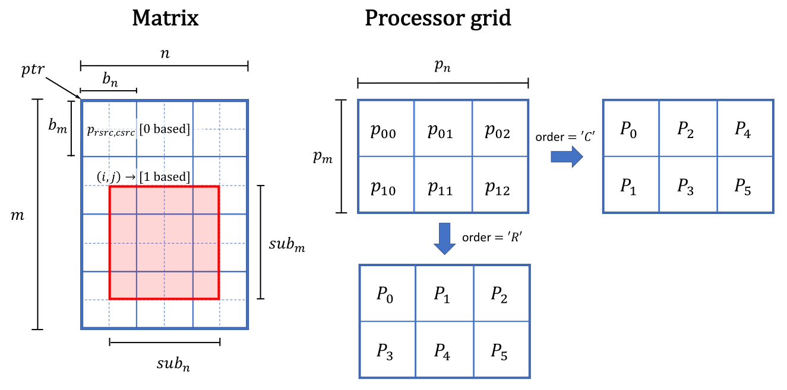
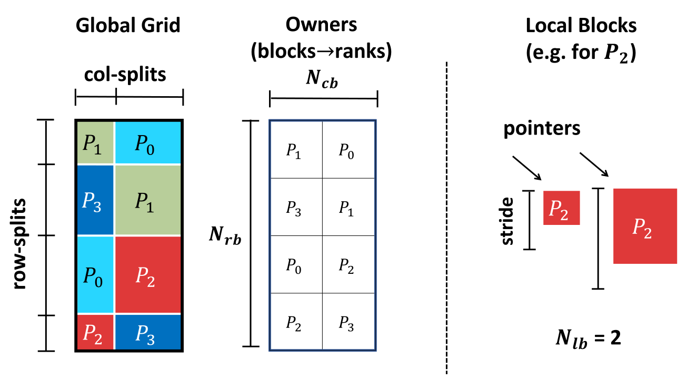
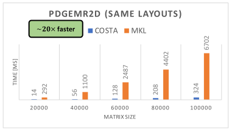
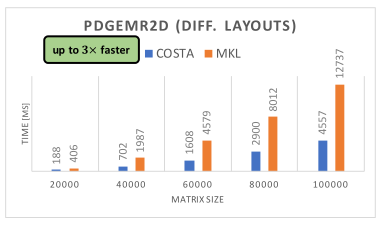

<p align="center"></p>

## Table of Contents
- [Overview](#overview)
- [Features](#features)
- [Installing in 30 seconds](#installing-in-30-seconds)
- [Examples](#examples)
    - [Block-cyclic (Scalapack) Layout](#block-cyclic-scalapack-layout)
    - [Custom (Arbitrary) Layout](#custom-arbitrary-layout)
    - [Initializing Layouts](#initializing-layouts)
    - [Transforming Matrix Layouts](#transforming-matrix-layouts)
    - [Scalapack Wrappers](#scalapack-wrappers)
- [Advanced Features](#advanced-features)
    - [Transforming Multiple Layouts](#transforming-multiple-layouts)
    - [Achieving Communication-Optimality](#achieving-communication-optimality)
- [Performance Results](#performance-results)
- [COSTA in Production](#costa-in-production)
- [Miniapps (for testing and benchmarking)](#miniapps-for-testing-and-benchmarking)
    - [Data-redistribution with pxgemr2d](#data-redistribution-with-pxgemr2d)
    - [Scale and Transpose with pxtran and pxtranu](#scale-and-transpose-with-pxtran-and-pxtranu)
    - [Communication Volume Reduction](#communication-volume-reduction)
- [Questions?](#questions)
- [Acknowledgements](#acknowledgements)

## Overview

COSTA is a communication-optimal, highly-optimised algorithm for data redistribution accross multiple processors, using `MPI` and `OpenMP` and offering the possibility to transpose and scale some or all data. It implements scalapack routines for matrix scale & transpose operations (`sub(C) = alpha * sub(A)^T + beta * C`, provided by `pxtran(u)`) and data redistribution (`sub(C) = sub(A)`, provided by `pxgemr2d`) and outperforms other scalapack implementations by orders of magnitude in some cases. Unlike previous redistribution algorithms, COSTA will also propose the relabelling of MPI ranks that minimizes the data reshuffling cost, leaving to users to decide if they want to use it. This way, if the initial and the target data distributions differ up to a rank permutation, COSTA will perform no communication, whereas other algorithms will reshuffle all the data. Thanks to its optimizations, significant speedups will be achieved even if the proposed rank relabelling is not used.

What makes COSTA more general than scalapack routines is that it is not limited only to block-cyclic data distributions, but can deal with completely arbitrary and irregular matrix distributions and can be easily generalized for n-dimensional tensors. 

Thanks to its scalapack wrappers, scalapack users do not need to change their code in order to use COSTA: it is enough to link your library to COSTA before linking to scalapack and all `pxtran, pxtranu` and `pxgemr2d` routines will automatically be using the COSTA algorithm.

## Features

COSTA has the following features:
- **scale, transpose \& reshuffle:** apart from redistribution, can also transpose, scale and sum initial and final layouts:
```
sub(B) = beta * sub(B) + alpha * sub(op(A)) ; op=N, T or C; sub = submatrix 
```
- **Arbitrary Layouts:** COSTA is not limited to block cyclic matrix layouts and can handle complitely irregular and arbitrary matrix distributions.
- **Multiple Layouts:** can transform multiple layouts at once (in the same communication round).
- **Highly-optimized:** it is highly-optimized in distributed and multithreaded settings.
- **Communication-Optimal:** proposes (but does not enforce) the optimal rank relabelling to minimize communication.
- **SCALAPACK wrappers:** provides scalapack wrappers for `pxgemr2d` and `pxtran(u)`.
- **Well Documented:** a detailed documentation is provided in this README.

## Installing in 30 seconds

Please refer to [INSTALL.md](INSTALL.md).

## Examples

### Block-cyclic (Scalapack) Layout

To represent an arbitrary block-cyclic (scalapack) layout, we can use the following function defined in `costa/layout.hpp` header:
```cpp
#include <costa/layout.hpp>
// ...
template <typename T>
grid_layout<T> costa::block_cyclic_layout<double>(
                   const int m, const int n,         // global matrix dimensions
                   const int b_m, const int b_n,     // block dimensions
                   const int i, const int j,         // submatrix start
                                                     // (1-based, scalapack-compatible)
                   const int sub_m, const int sub_n, // submatrix size
                   const int p_m, const int p_n,     // processor grid dimension
                   const char order,                 // rank grid ordering ('R' or 'C')
                   const int rsrc, const int csrc,   // coordinates of ranks oweing 
                                                     // the first row (0-based)
                   T* ptr,                           // local data of matrix A 
                                                     // (not the submatrix)
                   const int lld,                    // local leading dimension
                   const int rank                    // processor rank
               );
```
The arguments can be nicely visualized with the following figure, where the red submatrix is represented:
<p align="center"></p>

In case we want to represent the full matrix (instead of a submatrix), it suffices to put:
```cpp
// start of the submatrix is the start of the full matrix
int i = 1; int j = 1 // 1-based due to scalapack-compatibility
// size of the submatrix is that size of the full matrix
int sub_m = m; int sub_n = n
```

For a complete example of transforming between two block-cyclic matrix layouts, please refer to `examples/example0.cpp`.

### Custom (Arbitrary) Layout

To represent an arbitrary block-cyclic (scalapack) layout, we can use the following function defined in `costa/layout.hpp` header:
```cpp
#include <costa/layout.hpp>
// ...
template <typename T>
grid_layout<T> costa::custom_layout(
                   int rowblocks,       // number of global blocks (N_rb)
                   int colblocks,       // number of global blocks (N_cb)
                   int* rowsplit,       // [rowsplit[i], rowsplit[i+1]) is range of rows of block i
                   int* colsplit,       // [colsplit[i], colsplit[i+1]) is range of columns of block i
                   int* owners,         // owners[i][j] is the rank owning block (i,j). 
                                        // Owners are given in row-major order as assumed by C++.
                   int nlocalblocks,    // number of blocks owned by the current rank (N_lb)
                   block_t* localblocks // an array of block descriptions for the current rank
               );
```
where `block_t` is a simple struct defined in the same header:
```cpp
// each local block is assumed to be stored in col-major order
struct costa::block_t {
    void *data; // a pointer to the start of the local matrix
    int ld;     // leading dimension or distance between two consecutive local columns
    int row;    // the global block row index
    int col;    // the global block colum index
};
```

The arguments can be nicely visualized with the following figure:
<p align="center"></p>

For a complete example of transforming between a block-cyclic and a custom matrix layout, please refer to `examples/example1.cpp`.

### Initializing Layouts

Once the layouts are created as previously described, we can initialize them by providing a simple lambda function that maps global element coordinates `(i,j)` to the value to which the element should be initialized:

```cpp
// some user-defined layout
grid_layout<double> layout; 

// function f(i, j) := value of element (i, j) in the global matrix
// an arbitrary function
auto f = [](int i, int j) -> double {
    return i + j; 
};

// initialize it
layout.initialize(f);
```

In exactly the same way, we can check if the elements in the layout are equal to the values provided by the lambda function:
```cpp
// check if the values in the final layout correspond to function f
// that was used for the initialization of the initial layout
bool ok = layout.validate(f, 1e-12); // the second argument is the tolerance
```

### Transforming Matrix Layouts

Once the layouts are created as previously described, we can transform between two layouts in the following way (defined in header `<costa/grid2grid/transform.hpp>`):

- Redistribute with optional scaling and/or transpose. Performs `B = beta * B + alpha * op(A)`, where `op` can be transpose, conjugate or none (i.e. identity).
```cpp 
#include <costa/grid2grid/transform.hpp>
// ...
// redistribute a single layout with scaling:
// final_layout = beta * final_layout + alpha * initial_layout
template <typename T>
void transform(grid_layout<T> &initial_layout, // initial layout, A
               grid_layout<T> &final_layout,   // final layout, B
               const char trans,               // defines operation on A, op(A), can be:
                                               // 'N' for none, i.e. identity, 
                                               // 'T' for transpose
                                               // 'C' for conjugate
               const T alpha, const T beta,    // defines the scaling parameters alpha and beta
               MPI_Comm comm);                 // MPI communicator containing at least 
                                               // a union of communicators of both (initial and final) layouts
```

Observe that matrices do not necessarily have to be distributed over the same communicator. But the communicator passed to this function, must be at least a union of communicators containing each (initial and final) matrices.

For complete examples please refer to `examples`.

### Scalapack Wrappers

If installed with cmake option `COSTA_SCALAPACK` (e.g. with `cmake -DCOSTA_SCALAPACK=MKL ..`, which can also have values `CRAY_LIBSCI` or `CUSTOM`), then also the scalapack wrappers will be available for `pxgemr2d` (redistribute) and for `pxtran(u)` (transpose) routines. In this case, it is enough to link your library to `costa_scalapack` before linking to scalapack and these functions (for all types) will be overwritten by the COSTA implementation. Therefore, if you code is already using scalapack, there is no need to change your code, just linking is enough!

## Advanced Features

### Transforming Multiple Layouts

If multiple layouts should be transformed, COSTA is able to transform all of them at once, in the same communication round! This can be done using the `transformer` class defined in `costa/grid2grid/transformer.hpp>`, as illustrated below:

```cpp
#include <costa/grid2grid/transformer.hpp>
#include <costa/layout.hpp>
// ...
// a user-defined MPI communicator
MPI_Comm comm = MPI_COMM_WORLD;

// *******************************
// user-defined layouts
// *******************************
grid_layout<double> A1, B1;
grid_layout<double> A2, B2;

// *******************************
// transforming A1->B1 and A2->B2
// *******************************
char trans = 'N'; // do not transpose
double alpha = 1.0; // do not scale initial layouts
double beta = 0.0; // (do not scale final layouts

// create the transformer class
costa::transformer<double> transf(comm);

// schedule A1->B1
transf.schedule(A1, B1, trans, alpha, beta);

// schedule A2->B2
transf.schedule(A2, B2, trans, alpha, beta);

// trigger the transformations
transf.transform();
```

This is more efficient than transforming each of those separately, because all layouts are transformed within the same communication round. However, it might use more memory because the messages might be larger. 

### Achieving Communication-Optimality

In order to achieve communication-optimality, we would need to use the rank relabelling, that will be described step-by-step below.

So far, we have been only using `costa::grid_layout<T>` objects and we showed how we can transform between different layouts. This object contains two important pieces of information: the global matrix grid and also the local blocks for the current rank. The global matrix grid object is called `costa::assigned_grid2D` and is a simpler object than the layout, since it does not contain any information about the local data. For illustration purposes, we could write: `layout = grid + local_data`, or translated to classes, we could write: `grid_layout<T> = assigned_grid2D + local_data<T>`.

The global matrix grid (`costa::assigned_grid2D`) can be created in the same way as the layout object, we only need to exclude the information about the local data:
- block-cyclic grid can be created using the function:
```cpp
#include <costa/layout.hpp>
// ...
template <typename T>
assigned_grid2D costa::block_cyclic_grid<double>(
                    const int m, const int n,         // global matrix dimensions
                    const int b_m, const int b_n,     // block dimensions
                    const int i, const int j,         // submatrix start
                                                      // (1-based, scalapack-compatible)
                    const int sub_m, const int sub_n, // submatrix size
                    const int p_m, const int p_n,     // processor grid dimension
                    const char order,                 // rank grid ordering ('R' or 'C')
                    const int rsrc, const int csrc,   // coordinates of ranks oweing 
                                                      // the first row (0-based)
                );
```
Observe that this is the same as the `block_cyclic_layout` function, where the last three parameters are omitted. 

- custom grid
```cpp
#include <costa/layout.hpp>
// ...
// contains only the global grid, without local data
template <typename T>
assigned_grid2D costa::custom_grid(
                    int rowblocks, // number of global blocks (N_rb)
                    int colblocks, // number of global blocks (N_cb)
                    int* rowsplit, // [rowsplit[i], rowsplit[i+1]) is range of rows of block i
                    int* colsplit, // [colsplit[i], colsplit[i+1]) is range of columns of block i
                    int* owners,   // owners[i][j] is the rank owning block (i,j). 
                                   // Owners are given in row-major order as assumed by C++.
               );
```
Observe that this is the same as the `custom_layout` function, where the last two parameters are omitted.

In order to propose the communication-optimal rank relabelling, COSTA first has to analyse the global grids in all transformations we want to perform. Therefore, the first step is to create the grid objects. 

Assume we want to transform `A1->B1` and `A2->B2`. In the first step, we create the grid objects:

```cpp
#include <costa/layout.hpp>

// create grids (arbitrary, user-defined)
auto A1_grid = costa::custom_grid(...);
auto B1_grid = costa::block_cyclic_grid(...);

auto A2_grid = costa::block_cyclic_grid(...);
auto B2_grid = costa::custom_grid(...);
```
Now we want COSTA to analyse these grids, by computing the necessary communication volume:
```cpp
// compute the comm volume for A1->B1
auto comm_vol = costa::communication_volume(A1_grid, B1_grid);

// add the comm volume for A2->B2
comm_volume += costa::communication_volume(A2_grid, B2_grid);
```

Next, we can get the optimal rank relabelling:
```cpp
#include <costa/grid2grid/ranks_reordering.hpp>
// ...
bool reorder = false;
// input parameters:
// - comm_vol := communication volume object, created previously
// - P := communicator size
// output parameters:
// - rank_relabelling: ranks permutation yielding communication-optimal transformation
// - reordered: if true, the returned rank relabelling is not the identity permutation
std::vector<int> rank_relabelling = costa::optimal_reordering(comm_vol, P, &reordered);
```

Finally, we can use this rank relabelling as follows:
```cpp
#include <costa/grid2grid/transformer.hpp>
// ...
// get the current rank
int rank;
MPI_Comm_rank(comm, &rank);

// create the transformer object:
costa::transformer<T> transf(comm);

create full layout objects
auto A1 = costa::custom_layout(...); // local blocks should correspond to rank `rank`
auto B1 = costa::block_cyclic_layout(...); // local blocks should correspond to rank `rank_relabelling[rank]`

// schedule A1->B1
transf.schedule(A1, B1); // trans, alpha and beta parameters are optional

auto A2 = costa::block_cyclic_layout(...); // local blocks should correspond to rank `rank`
auto B2 = costa::custom_layout(...); // local blocks should correspond to rank `rank_relabelling[rank]`

// schedule A2->B2
transf.schedule(A2, B2); // trans, alpha and beta parameters are optional

// trigger the transformations which are now communication optimal
transf.transform();
```

## Performance Results

The performance of COSTA was compared with MKL SCALAPACK v19.1 on the [Piz Daint supercomputer](https://www.cscs.ch/computers/piz-daint/) (Cray XC40) from Swiss National Supercomputing Centre (CSCS). To make a fair comparison, we compared the performance of the scalapack routine `pdgemr2d` redistributing the matrices between different layouts, that is also provided by COSTA. In addition, we did not use communication-optimal rank relabelling in COSTA nor hidden memory pools or memory resuse between the calls. The benchmark code is available in the provided [miniapp](#data-redistribution-with-pxgemr2d).

We ran the benchmark on `8` nodes (each having 36 cores) and `16=4x4` MPI ranks. The square matrices are used which sizes were varied. When both initial and final matrices had exactly the same block-cyclic layout, with block sizes being 128x128, the following results have been achieved:
<p align="center"></p>

When initial and final layouts had different block sizes, i.e. the initial block sizes are `36x36` whereas the final block size is `128x128`, then the following results have been achieved:
<p align="center"></p>

Therefore, COSTA is highly-optimised even when no rank relabelling is used. If rank relabelling was used, even further speedups would be possible.

## COSTA in Production

COSTA is used by communication-optimal matrix-multiplication algorithm [COSMA](https://github.com/eth-cscs/COSMA) which is used in the Quantum Chemistry Simulator [CP2K](https://www.cp2k.org).

## Miniapps (for testing and benchmarking)

### Data-redistribution with pxgemr2d

COSTA implements ScaLAPACK `pxgemr2d` routines that transforms the matrix between two block-cyclic data layouts (`sub(C) = sub(A)`) where the two matrices do not necessarily have to belong to the same MPI communicators. In addition, COSTA will propose the MPI rank relabelling that minimizes the data reshuffling cost and that user is free to choose whether to use it. 

The miniapp consists of an executable `./build/examples/pxgemr2d_miniapp` which can be run as follows (assuming we are in the root folder of the project):

```bash
# set the number of threads to be used by each MPI rank
export OMP_NUM_THREADS=18
# if using CPU version with MKL backend, set MKL_NUM_THREADS as well
export MKL_NUM_THREADS=18 
# run the miniapp
mpirun -np 4 ./build/examples/pxgemr2d_miniapp -m 1000 -n 1000 \
                                            --block_a=128,128 \ 
                                            --block_c=128,128 \
                                            --p_grid_a=2,2 \
                                            --p_grid_c=2,2 \
                                            --type=double \
                                            --algorithm=costa
```

The overview of all supported options is given below:
- `-m (--m_dim)` (default: `1000`): number of rows of matrices `A` and `C`.
- `-n (--n_dim)` (default: `1000`): number of columns of matrices `A` and `C`. 
- `--block_a` (optional, default: `128,128`): 2D-block size for matrix A. 
- `--block_c` (optional, default `128,128`): 2D-block size for matrix C.
- `-p (--p_grid_a)` (optional, default: `1,P`): 2D-processor grid for matrix A. By default `1xP` where `P` is the total number of MPI ranks.
- `-q (--p_grid_c)` (optional, default: `1,P`): 2D-processor grid for matrix C. By default `1xP` where `P` is the total number of MPI ranks.
- `-r (--n_rep)` (optional, default: 2): number of repetitions.
- `-t (--type)` (optional, default: `double`): data type of matrix entries. Can be one of: `float`, `double`, `zfloat` and `zdouble`. The last two correspond to complex numbers.
- `--test` (optional): if present, the result of COSTA will be verified with the result of the available SCALAPACK.
- `--algorithm` (optional, default: `both`): defines which algorithm (`costa`, `scalapack` or `both`) to run.
- `-h (--help) (optional)`: print available options.

### Scale and Transpose with pxtran and pxtranu

COSTA implements ScaLAPACK `pxtran` and `pxtranu` routines that performs the scale and transpose operation, given by:
```sub(C) = alpha * sub(A)^T + beta * sub(C)```
In addition, COSTA will propose the MPI rank relabelling that minimizes the data reshuffling cost and that user is free to choose whether to use it. 

The miniapp consists of an executable `./build/examples/pxtran_miniapp` which can be run as follows (assuming we are in the root folder of the project):

```bash
# set the number of threads to be used by each MPI rank
export OMP_NUM_THREADS=18
# if using CPU version with MKL backend, set MKL_NUM_THREADS as well
export MKL_NUM_THREADS=18 
# run the miniapp
mpirun -np 4 ./build/examples/pxtran_miniapp -m 1000 -n 1000 -k 1000 \
                                            --block_a=128,128 \ 
                                            --block_c=128,128 \
                                            --p_grid=2,2 \
                                            --alpha=1 \
                                            --beta=1 \
                                            --type=double \
                                            --algorithm=costa
```

The overview of all supported options is given below:
- `-m (--m_dim)` (default: `1000`): number of rows of matrices `A` and `C`.
- `-n (--n_dim)` (default: `1000`): number of columns of matrices `A` and `C`. 
- `--block_a` (optional, default: `128,128`): 2D-block size for matrix A. 
- `--block_c` (optional, default `128,128`): 2D-block size for matrix C.
- `-p (--p_grid)` (optional, default: `1,P`): 2D-processor grid. By default `1xP` where `P` is the total number of MPI ranks.
- `--alpha` (optional, default: 1): alpha parameter in `sub(C) = alpha*sub(A)^T + beta*sub(C)`.
- `--beta` (optional, default: 0): beta parameter in `sub(C) = alpha*sub(A)^T + beta*sub(C)`.
- `-r (--n_rep)` (optional, default: 2): number of repetitions.
- `-t (--type)` (optional, default: `double`): data type of matrix entries. Can be one of: `float`, `double`, `zfloat` and `zdouble`. The last two correspond to complex numbers.
- `--test` (optional): if present, the result of COSTA will be verified with the result of the available SCALAPACK.
- `--algorithm` (optional, default: `both`): defines which algorithm (`costa`, `scalapack` or `both`) to run.
- `-h (--help) (optional)`: print available options.

### Communication Volume Reduction

Measuring the total communication volume reduction (in \%) that can be achieved by process relabeling can be done by running the `comm_volume` miniapp, without using `MPI`. The miniapps assumes a matrix with dimensions `m x n` is transformed between two block-cyclic layouts which are specified by block sizes and process grids. The suffix `_a` refers to the initial layout and the suffix `_b` refers to the target layout.

```bash
./miniapps/comm_volume -m 100000 -n 100000 \
                       --block_a=100,100 --p_grid_a=2,4 \
                       --block_c=100,100 --p_grid_c=4,2
output:
Comm volume reduction [%] = 33.3333
```

## Questions?

For questions, feel free to contact us at (marko.kabic@cscs.ch), and we will soon get back to you. 

## Acknowledgements

This work was funded in part by:  

 | [**ETH Zurich**](https://ethz.ch/en.html)**: Swiss Federal Institute of Technology in Zurich**
| :------------------- | :------------------- |
 | [**CSCS**](https://www.cscs.ch)**: Swiss National Supercomputing Centre**
